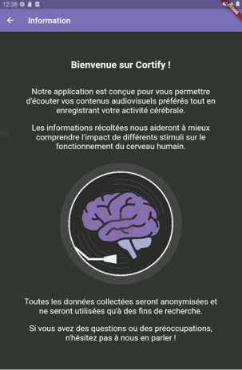
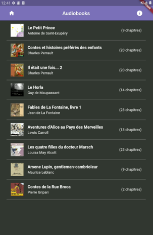
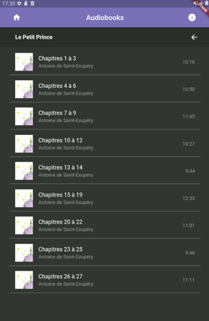
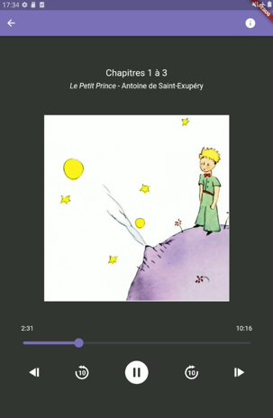
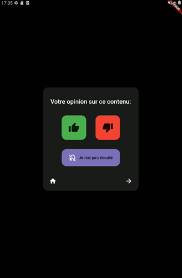

# Cortify

Cortify is a Flutter android application that plays plays audio-visual stimuli and records log files with information about playback history. 
It was designed to be made available during hospital stays to patients undergoing intracranial EEG, both providing them with stimulation and allowing the collection and analysis of ecological data. 

## 🛠 Architecture and dependencies
Cortify adheres to the Flutter SDK's standard widget-based architecture. Some key dependencies and their uses are as follows:

  - audio_session: Manage audio sessions.
  - just_audio: Play audio.
  - logging: Log relevant data and activities.
  - external_path: Handle external storage paths.
  - volume_watcher: Monitor and adjust volume.
  - device_info: Fetch device-specific information.
  - flutter_audio_query: Query audio data.
  - audioplayers: Play audio.
  - video_player: Play video files.
  - flutter_ffmpeg: Handle FFmpeg commands in Flutter.

Additionally, the app makes use of various assets like icons and audio triggers, as indicated in the `assets` section.


## 📸 Screenshots

### Home screen & Information screen



### Playlist navigation



### Audio and Video players



### Feedback screen



## 🚀 Getting Started
To get started with the project, including its submodules, follow these steps:

- Clone this repository with its submodules:
  ```
  git clone --recursive https://github.com/pimpimpula/cortify.git
  ```
- Navigate to the project directory:
  ```
  cd cortify
  ```
- Install dependencies:
  ```
  flutter pub get
  ```
- Run the app:
  ```
  flutter run
  ```

## 🧩 Working with Submodules

This repository contains two submodules:

1. **Cortifind_data**: An application that collects and parses the logs created by Cortify, helping to identify which iEEG data files are relevant to collect for research purposes.
2. **Cortify_AddMedia**: This repository deals with creating audiovisual stimuli for the app, where the second channel of the audio contains a unique trigger signal for synchronization with the recorded electrophysiological data. It also handles formatting the newly-created stimuli to playlists for presentation in the main Cortify app.


If you've already cloned the repository and forgot to include `--recursive`, or if the submodules have been updated, run the following to initialize and fetch the submodules:

```
git submodule init
git submodule update
```

**Updating a submodule (e.g., Cortifind_data)**:
- Navigate to the submodule's directory:
  ```
  cd path/to/Cortifind_data
  ```
- Make changes and commit them:
  ```
  git commit -m "Your commit message for Cortifind_data"
  ```
- Push the submodule updates:
  ```
  git push origin master
  ```

- Navigate back to the main repository root and commit the submodule's new state:
  ```
  git add path/to/Cortifind_data
  git commit -m "Updated Cortifind_data submodule"
  git push origin master
  ```

## 📚 Useful Documentation

- [Flutter](https://docs.flutter.dev/)
- [Android Studio]()
